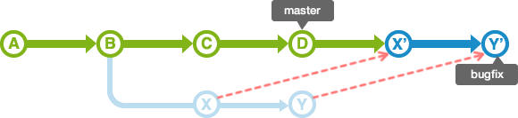
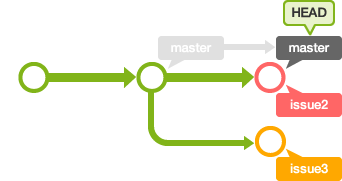

# 👉 Git Branch 사용하기

---

```bash
$ git branch #현재 존재하는 branch 조회
$ git checkout #현재 작업중인 brach 조회
$ git checkout branch1 #전환
```


```bash
$ git branch branch1 master
```

+ master에서 branch1이름의 branch 만들기


```bash
$ git checkout -b branch1 master
```

+ master에서 branch1이름의 branch 만들고 checkout함(전환)


```bash
$ git branch -d branch1 #삭제(github는 유지)
$ git push origin -delete branch1 #삭제(github는 삭제)
```


# 👉 merge와 rebase
---
두 개의 branch를 합치는 방법으로는 merge와 rebase가 있다.
차이점을 한번 알아본 후 merge시 주의할 점도 알아보자.

## merge와 rebase의 차이
---


현 상태가 위와 같다고 가정을 해본다.

merge를 하게 되면 아래 그림과 같은 로그가 남겨진다.


rebase를 하게 되면 아래 그림과 같은 로그가 남겨진다.



명백한 차이점이 있다!
+ merge : 변경된 점의 모든 로그가 남는다. (큰 프로젝트면 복잡해짐)
+ rebase : 로그가 단순하게 변경되지만, 정확한 로그를 남기는 것이 불가능해 진다.

## merge시 fast-forward 충돌 해결법
---


다음과 같이 master branch와 bugfix branch가 있다고 가정한다.

이제 merge를 하게 되면


bugfix branch가 master의 모든 이력을 포함하고 있기 때문에 master branch가 단순히 이동하기만 한다. 이것이 바로 **fast-forward**..

**How to solve**


단순하게 master branch에 변경점을 주고 commit하면 될 것 같다.

```
$ git merge --no-ff
```
merge를 할때 다음과 같은 옵션을 주게 되면


위 사진과 같이 fast-forward merge를 하지 않는다. 이렇게 하면 merge를 한 이후에도 bugfix branch를 계속해서 사용할 수 있다.

**다음은 문제가 발생한 후의 대처법이다.**


위 그림을 보면 master와 issue2가 fast-forward merge되었다.

이 상태에서 issue3와 merge를 할 시 같은 파일의 같은 행이 변경 된다면 분명 오류가 날 것이며 파일이 다음과 같이 변경 될 것의 예시이다.

```
111111111111111
222222222222222
<<<<<<< HEAD
333333333333333
=======
444444444444444
>>>>>>> issue3
```
이제

```
111111111111111
222222222222222
333333333333333
444444444444444
```

다음과 같이 변경해주고 commit하면 문제가 해결 된다. (이것도 non fast-forward 방식)

# 👉 How to use in our project?
---

